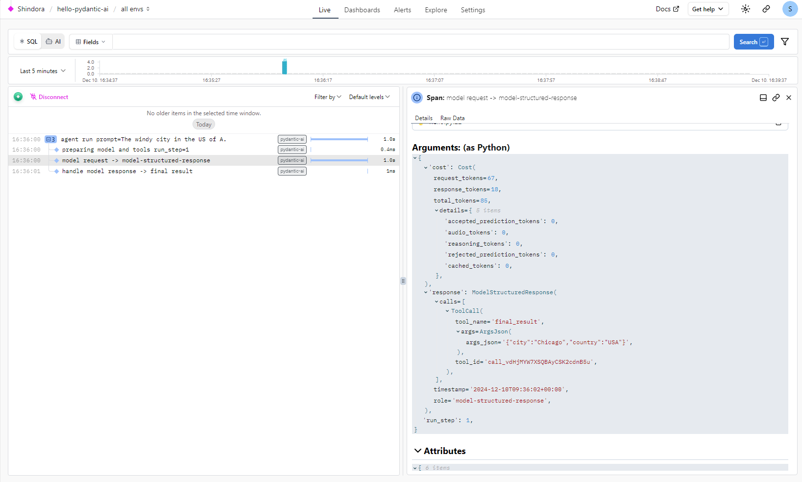

# Pydantic Logfire OpenAI Example

A template project demonstrating integration of Pydantic, Logfire, and OpenAI for structured logging and AI response generation.
### Example:
Image from Logfire:


## Prerequisites

- Python 3.12+
- OpenAI API key
- Logfire API key

## Installation

```bash
uv pip install -r pyproject.toml
```

## Configuration
Create a .env file in the project root:
```bash
OPENAI_API_KEY=your_openai_api_key
LOGFIRE_API_KEY=your_logfire_api_key
```

## Usage
```bash
uv run -m hello
```

## License
MIT
